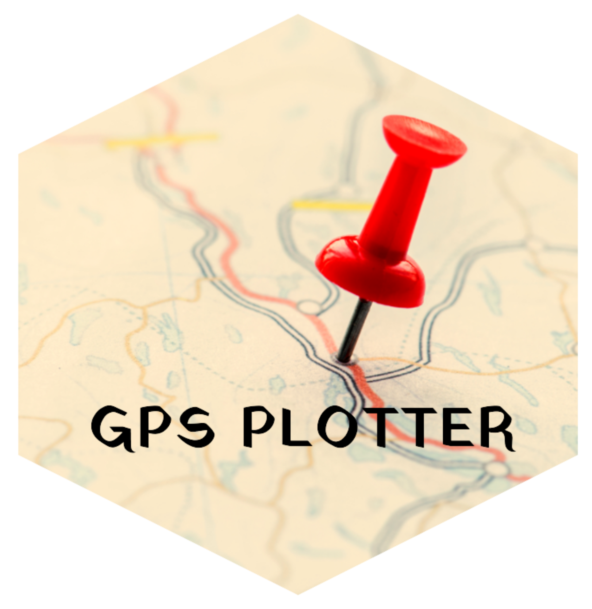

# GPS-Plotter App



Welcome to the GPS-Plotter app, a user-friendly tool for visualizing GPS data. The app is built using the [Shiny](https://shiny.rstudio.com/) framework in [R](https://www.r-project.org/). It is designed to be easy to use and deploy, and it can be hosted on platforms like [shinyapps.io](https://www.shinyapps.io/).

## Getting Started

You can try the app right away by visiting this URL: [GPS-Plotter App](https://himal-shrestha.shinyapps.io/GPS-plotter/)

Alternatively, if you prefer to run the app locally or want to make custom modifications, follow these steps:

1. Run the app locally using this command within RStudio:
   ```R
   shiny::runGitHub("GPS-plotter", "himal2007")
   ```

2. If you want to make custom modifications, you can clone the repository to your local machine:
   ```
   git clone https://github.com/himal2007/GPS-plotter.git
   ```

3. Install the necessary R packages using the following command:
   ```R
   install.packages(c("shiny", "shinyjs", "leaflet", "shinycustomloader"))
   ```

4. Open RStudio and navigate to the app's directory.

5. Run the app using the following R command within the RStudio console:
   ```R
   shiny::runApp()
   ```

## Features

The GPS-Plotter app provides the following features:

- **Visualise GPS Data**: Upload your GPS data in various formats (GPX, KML, etc.) to visualize your routes on an interactive map.

- **Data Exploration**: Explore the details of your GPS data, including waypoints, trackpoints, and routes.

- **Easy Deployment**: The app is easy to deploy, and it can be hosted on platforms like [shinyapps.io](https://www.shinyapps.io/).

## Support and Contributions

If you encounter any issues, have suggestions, or want to contribute to this project, feel free to open an issue or submit a pull request on GitHub.

Happy mapping and exploring your GPS data with the GPS-Plotter app!

>**Disclaimer**: This app is provided as-is without any warranty. Use at your own discretion and responsibility. The authors and contributors are not liable for any data loss or inaccuracies that may occur while using the app.